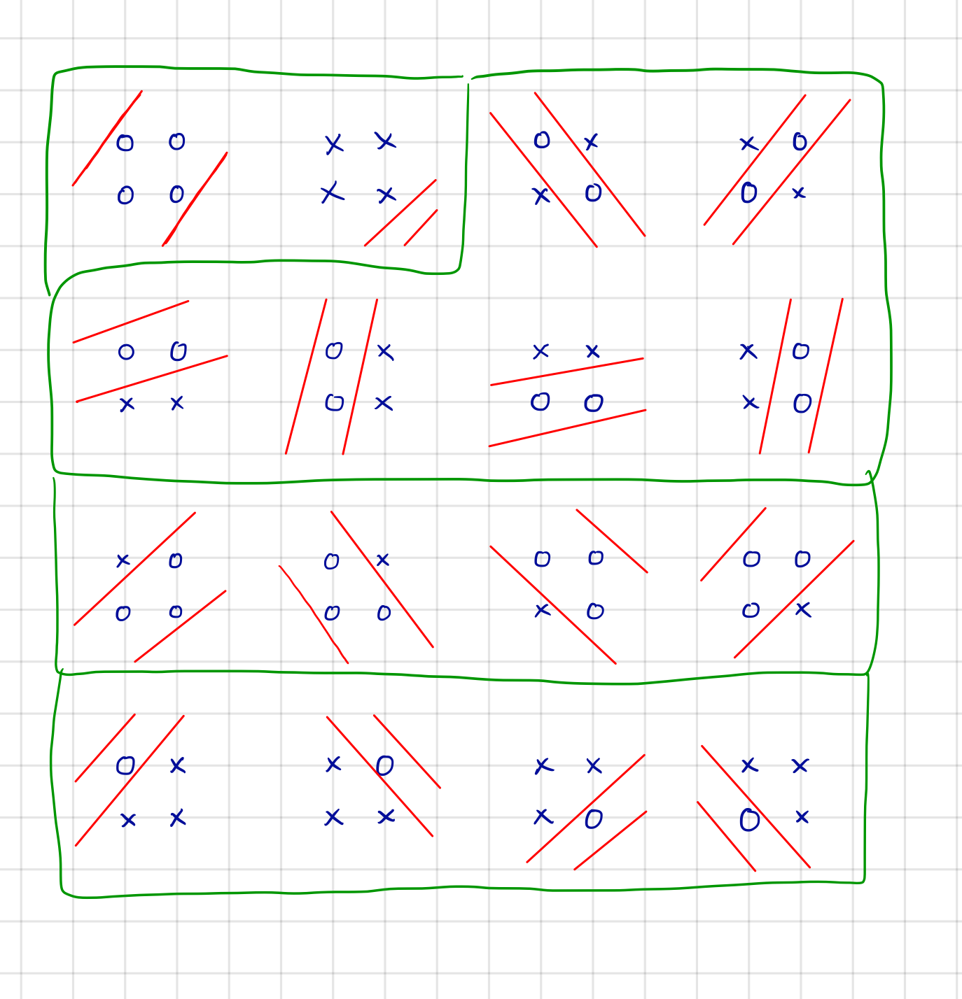

---
export_on_save:
  phantomjs: "pdf"
---

# Machine Learning Foundations Homework #2

B04902083 莊翔旭

@import "./coursera.png"

<!-- pagebreak -->

## problem 2

$|w_0 + w_1x_1 + w_2x_2| \leq θ \Rightarrow -θ \leq w_0 + w_1x_1 + w_2x_2 \leq θ \Rightarrow \text{2D intervals}$

4 points can shatter, so $4 \leq d_{vc}$

## problem 3

1. 存在 $F^{n \times 2^n}$ 的矩陣 $A$，對矩陣 $A$ 中的每個元素 $sign(|A_{i,j}-2|-1)$ 過後的矩陣 $A'$ 滿足 $A'_i \neq A'_j, i \neq j$ ( 所有的 dichotomy )
$$
\begin{bmatrix}
    A_{1,1} & A_{1,2} & A_{1,3} & \dots  & A_{1,2^n} \\
    A_{2,1} & A_{2,2} & A_{2,3} & \dots  & A_{2,2^n} \\
    \vdots & \vdots & \vdots & \ddots & \vdots \\
    A_{n,1} & A_{n,2} & A_{n,3} & \dots  & A_{n,2^n}
\end{bmatrix} \overset{sign(|A_{i,j}-2|-1)}{\Rightarrow}
\begin{bmatrix}
    1 & -1 & 1 & \dots  & -1 \\
    1 & 1 & -1 & \dots  & -1 \\
    \vdots & \vdots & \vdots & \ddots & \vdots \\
    1 & 1 & 1 & \dots  & -1
\end{bmatrix}
$$

2. 把 n 個點寫成 4 進制得到:
  $X:x_i = \sum^{2^n}_{j = 1} A_{i,j}\times4^{jp}$,for $i \in N$ and $1 \leq i  \leq n$, p 是一個足夠大的正整數
3. 若 $\alpha = \frac{1}{4^{rp}}$,r 為 1 到 $2^n$ 之間的整數都可以對應到一個 dichotomy（因為 $\alpha X$ mod 4 = $A_{r}$（因為 p 足夠大，小數點可省略） = 其中一個 dichotomy）
4. 對於 n 個 inputs 可以滿足出所有 $2^n$ 的可能，can shatter by n inputs $\Rightarrow d_{vc} = \infty$

<!-- pagebreak -->
## problem 4

$$
\begin{align*}
  &\text{Let } d_{vc}(\mathcal{H}_1 \cap \mathcal{H}_2) = n\\
  &\Rightarrow d_{vc}(\mathcal{H}_1 \cap \mathcal{H}_2) \text{ can shatter by $k \leq n$ input}\\
  &\Rightarrow d_{vc}(\mathcal{H}_2) \text{ also can shatter by $k \leq n$ input}(\because \mathcal{H}_1 \cap \mathcal{H}_2 \subseteq  \mathcal{H}_2 )\\
  &\Rightarrow n \leq d_{vc}(\mathcal{H}_2)\\
  &\Rightarrow d_{vc}(\mathcal{H}_1 \cap \mathcal{H}_2) \leq d_{vc}(\mathcal{H}_2)
\end{align*}
$$

## problem 5

題目 $\mathcal{H}_1 \cap \mathcal{H}_2$ 可以轉換成 positive and negative rays as $\mathcal{H}_3$，在投影片 lecture 5 22/27 的 funtime 題目表示 $m_{\mathcal{H}_3} = 2(N+1)-2 = 2N \Rightarrow d_{vc}(\mathcal{H}_3) = 2 = d_{vc}(\mathcal{H}_1 \cap \mathcal{H}_2)$

## problem 6

$$
\begin{align*}
&s = +1, \Rightarrow \mu=\frac{|\theta|}{2} \text{ and } s = -1, \Rightarrow \mu=\frac{2-|\theta|}{2} \\
&\Rightarrow \mu = \frac{s+1}{2} \times \frac{|\theta|}{2} + (-\frac{s-1}{2}) \times \frac{2-|\theta|}{2}\\
&\Rightarrow \mu = \frac{s|\theta|-s+1}{2}
\\
&E_{out} = \lambda\mu + (1-\lambda)(1-\mu) \text{, and } \lambda = 0.8\\
&\Rightarrow E_{out} = 0.8 (\frac{s|\theta|-s+1}{2}) + 0.2(1 - \frac{s|\theta|-s+1}{2})\\
&\Rightarrow E_{out} = 0.5  + 0.3s(|\theta|-1)
\end{align*}
$$

## problem 7

@import "./histogram.png"

<!-- pagebreak -->
## Bonus

如果把 $\binom{N}{i}$ 看成 N 個 inputs 中有 i 個 + 的 dichotomy 數量，則 $\sum^{k-1}_{i=1}\binom{N}{i}$ 就會是從沒有 + 到 k-1 個 + 所有 dichotomy 數量相加，假設值為 R：

1. dichotomy 的數量 R 不能夠 shatter k 個 points
  * 因為要 shatter k 個 points 就必須包含 k 個 + 的 dichotomy，但 R 只有包含到 k-1 個
2. R 可能不是最大值（因為最大值可能還會包含一些 k 個 + 的 dichotomy）

所以 $B(N,k) \geq \sum^{k-1}_{i=1}\binom{N}{i}$，結合課堂結果 $B(N,k) \leq \sum^{k-1}_{i=1}\binom{N}{i} \Rightarrow B(N,k)= \sum^{k-1}_{i=1}\binom{N}{i}$
